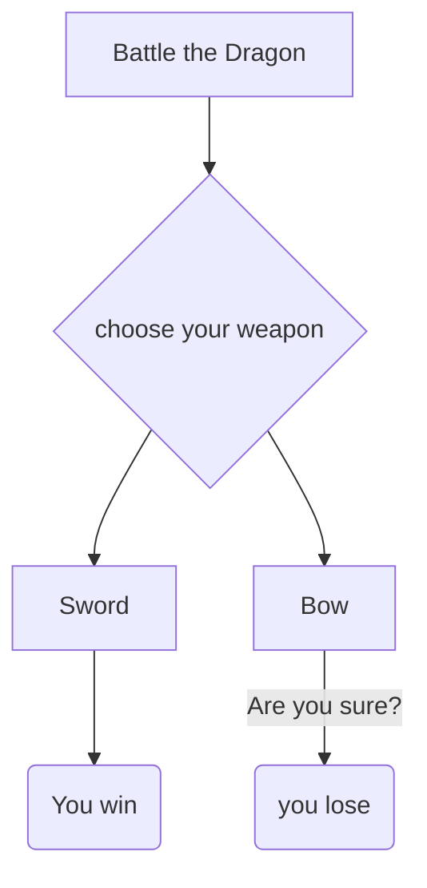

```mermaid

flowchart TD
A[Battle the Dragon]
A --> B{choose your weapon}
B --> C[Sword]
B --> D[Bow]
C --> E(You win)
D --> |Are you sure?| F(you lose)

```

*A* Name of Adventure
*B* Decision to be made 
*C* Choice 1
*D* Choice 2
*E* Ending 1
*F* Ending 2