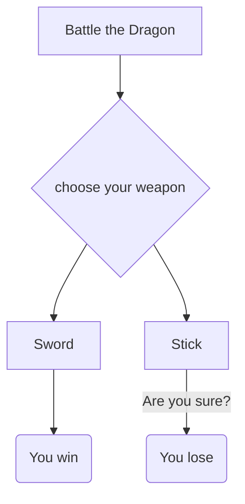

*A* - Name of Adventure

*B* - Decision to be made 

*C* - Choice 1

*D* - Choice 2

*E* - Ending 1

*F* - Ending 2

The significance of the relationships is you need to decide which weapon (B) either the sword (C) or the stick (D)would help you best battle the dragon (A). E and F are the results of the right decision (C) and the wrong decision (D)