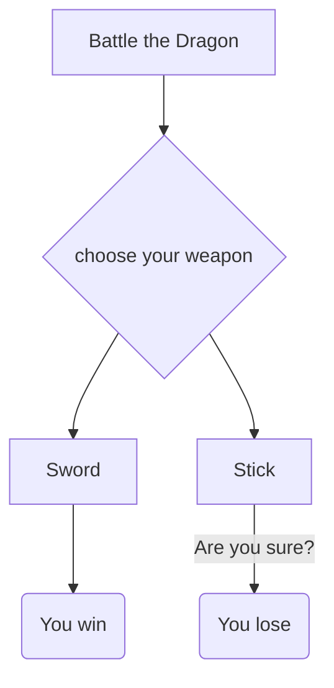

*_A_* - Name of Adventure

*_B_* - Decision to be made 

*_C_* - Choice 1

*_D_* - Choice 2

*_E_* - Ending 1

*_F_* - Ending 2

The significance of the relationships is you need to decide which weapon(B) either the sword(C) or the stick(D) would help you best battle the dragon(A). E and F are the results of the right decision(C) and the wrong decision(D)